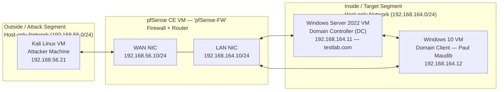
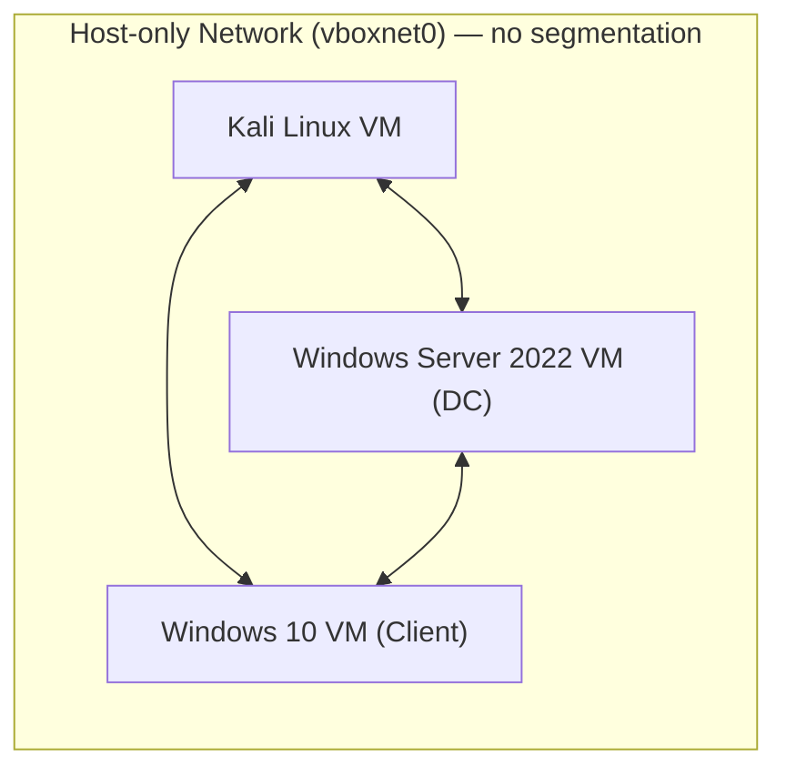

# Cybersecurity Home Lab — Network Diagram

**Last updated:** 2026-08-23
**Platform:** Oracle VirtualBox 7.2.6
**Status:** Tier 1 (Network Foundations) complete — as-built

## As-Built State — Tier 1 Complete

This diagram reflects the lab exactly as built and confirmed working, including final IP addressing. See the companion checklist doc (`2026-08-06_tier1-network-foundations-checklist.md`) for the step-by-step build, and `2026-08-23_tier1-build-report.md` for the full narrative, troubleshooting log, and firewall rule set.

## As-Built Addressing

| Device | Interface | IP Address | Gateway | Notes |
|---|---|---|---|---|
| pfSense-FW | WAN | 192.168.56.10/24 | — | Faces Kali; no upstream gateway (isolated segment) |
| pfSense-FW | LAN | 192.168.164.10/24 | — | Gateway for the Inside segment |
| Kali Linux | eth0 | 192.168.56.21/24 | 192.168.56.10 | Attacker VM |
| Windows Server 2022 (DC) | Ethernet | 192.168.164.11/24 | 192.168.164.10 | Domain Controller (DC), Active Directory (AD) domain `testlab.com`, DNS points to self (127.0.0.1) |
| Windows 10 (Client) | Ethernet | 192.168.164.12/24 | 192.168.164.10 | User: Paul Maudib; DNS points to DC (192.168.164.11) |

## Legend

| Component | Role |
|---|---|
| Kali Linux VM | Attack simulation machine — sits on its own segment, outside the "protected" network |
| pfSense CE VM | Virtual firewall and router (FW) — controls and logs traffic between the two segments |
| Windows Server 2022 VM | Domain Controller (DC) — runs Active Directory (AD), the service that manages users, computers, and permissions for the network |
| Windows 10 VM | Domain Client — a regular user workstation joined to the AD domain |
| Host-only Networks | VirtualBox virtual switches — each isolates traffic to only the VMs attached to it; neither has internet access |

## Firewall Rules (As-Built)

**LAN rules** (Client → DC, Active Directory logon ports — for firewall-syntax practice; not actually enforced since Client and DC share a subnet and this traffic never routes through pfSense — see the build report for why):

| Source | Destination | Protocol | Port | Purpose |
|---|---|---|---|---|
| 192.168.164.12 (Client) | 192.168.164.11 (DC) | TCP/UDP | 53 (DNS) | Domain Name System — name resolution |
| 192.168.164.12 (Client) | 192.168.164.11 (DC) | TCP/UDP | 88 (Kerberos) | Authentication |
| 192.168.164.12 (Client) | 192.168.164.11 (DC) | TCP/UDP | 389 (LDAP) | Directory query/lookup |

**WAN rules** (Kali → DC, controlled attack path — genuinely enforced and logged):

| Source | Destination | Protocol | Port | Purpose |
|---|---|---|---|---|
| 192.168.56.21 (Kali) | 192.168.164.11 (DC) | ICMP | — | Connectivity testing |
| 192.168.56.21 (Kali) | 192.168.164.11 (DC) | TCP/UDP | 3389 (RDP) | Remote Desktop Protocol attack surface |
| 192.168.56.21 (Kali) | 192.168.164.11 (DC) | TCP | 445 (SMB) | Server Message Block — file sharing / attack surface |

All three WAN rules block-by-default otherwise (pfSense's WAN interface has no other rules — implicit deny-all), and RFC1918 (private network) blocking was deliberately disabled on WAN since the WAN segment itself is a private range.

## Current State (Before Tier 1)

For reference, this is the flat network from the original setup — all three VMs on one Host-only Network with no firewall between them:

## Planned Future Additions (Tier 2+)

- **SIEM VM** (Security Information and Event Management — a system that collects and analyzes logs from other machines): planned to sit on the Inside segment, receiving logs from the DC, Client, and pfSense/OPNsense.
- **Second NAT adapter** on each VM (optional): for internet access/updates, kept separate from the Host-only adapters used for lab traffic.
