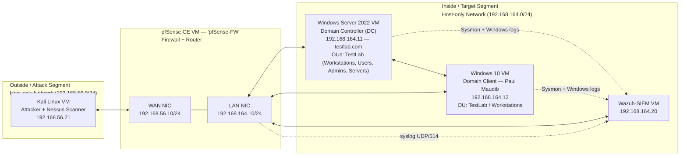
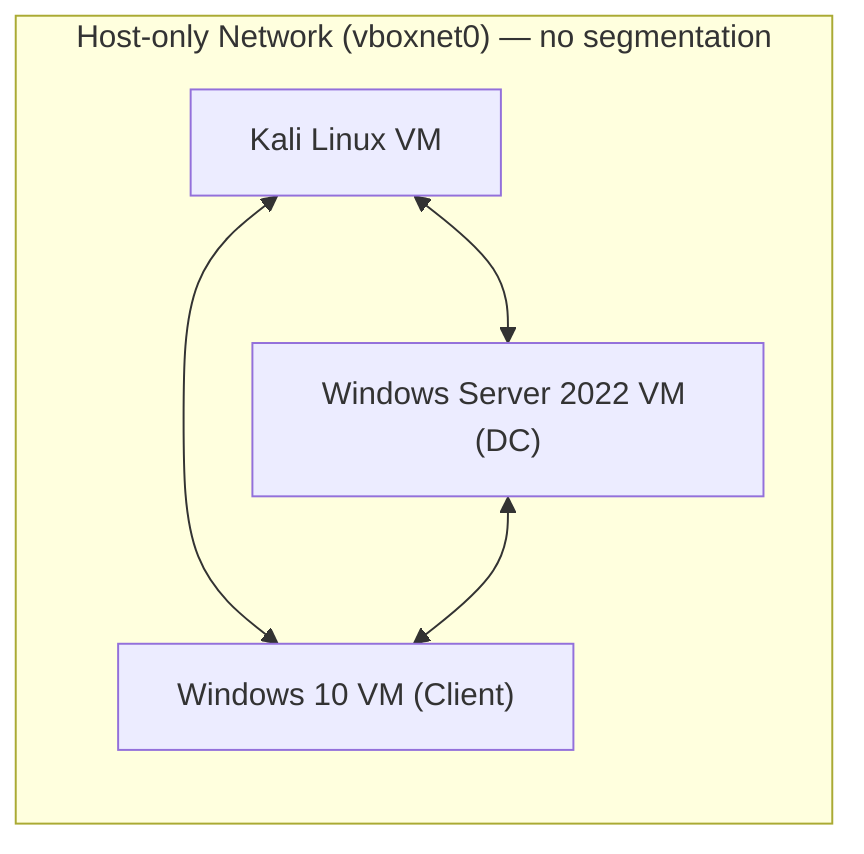

# Cybersecurity Home Lab — Network Diagram

**Last updated:** 2026-10-04
**Platform:** Oracle VirtualBox 7.2.6
**Status:** Tier 1 (Network Foundations), Tier 2 (Visibility/SIEM), and Tier 3 (AD Hardening Baseline) complete — as-built

## As-Built State — Tier 3 Complete

This diagram reflects the lab as built and confirmed working, including final IP addressing and the Active Directory structure. See the build reports for the full narratives and troubleshooting logs: `2026-08-23_tier1-build-report.md`, `2026-09-13_tier2-build-report.md`, and `2026-10-04_tier3-build-report.md`.

```mermaid
flowchart LR
    subgraph OUTSIDE["Outside / Attack Segment<br/>Host-only Network (192.168.56.0/24)"]
        KALI["Kali Linux VM<br/>Attacker + Nessus Scanner<br/>192.168.56.21"]
    end

    subgraph FW["pfSense CE VM — 'pfSense-FW'<br/>Firewall + Router"]
        direction LR
        WAN["WAN NIC<br/>192.168.56.10/24"]
        LAN["LAN NIC<br/>192.168.164.10/24"]
        WAN --- LAN
    end

    subgraph INSIDE["Inside / Target Segment<br/>Host-only Network (192.168.164.0/24)"]
        DC["Windows Server 2022 VM<br/>Domain Controller (DC)<br/>192.168.164.11 — testlab.com<br/>OUs: TestLab (Workstations, Users, Admins, Servers)"]
        CLIENT["Windows 10 VM<br/>Domain Client — Paul Maudib<br/>192.168.164.12<br/>OU: TestLab / Workstations"]
        SIEM["Wazuh-SIEM VM<br/>192.168.164.20"]
        DC <--> CLIENT
        DC -. Sysmon + Windows logs .-> SIEM
        CLIENT -. Sysmon + Windows logs .-> SIEM
    end

    KALI <--> WAN
    LAN <--> DC
    LAN <--> CLIENT
    LAN <--> SIEM
    LAN -. syslog UDP/514 .-> SIEM
```

## As-Built Addressing

| Device | Interface | IP Address | Gateway | Notes |
|---|---|---|---|---|
| pfSense-FW | WAN | 192.168.56.10/24 | — | Faces Kali; no upstream gateway (isolated segment) |
| pfSense-FW | LAN | 192.168.164.10/24 | — | Gateway for the Inside segment; forwards firewall events via syslog to Wazuh |
| Kali Linux | eth0 | 192.168.56.21/24 | 192.168.56.10 | Attacker VM; Nessus Essentials scanner; route to `192.168.164.0/24` via pfSense |
| Windows Server 2022 (DC) | Ethernet | 192.168.164.11/24 | 192.168.164.10 | Domain Controller (DC), Active Directory (AD) domain `testlab.com`, DNS points to self (127.0.0.1); Wazuh agent + Sysmon installed; SMB null sessions restricted by GPO; domain password and audit policy GPOs applied; 3DES cipher disabled via Schannel |
| Windows 10 (Client) | Ethernet | 192.168.164.12/24 | 192.168.164.10 | User: Paul Maudib (in `TestLab / Users`); computer in `TestLab / Workstations`; DNS points to DC (192.168.164.11); Wazuh agent + Sysmon installed; Remote Registry started for authenticated scans |
| Wazuh-SIEM (Amazon Linux 2023) | eth0 | 192.168.164.20/24 | 192.168.164.10 | Security Information and Event Management (SIEM) — collects DC/Client agent telemetry and pfSense syslog |

## Active Directory Structure (Tier 3)

| Object | Location | Purpose |
|---|---|---|
| `TestLab` OU | `testlab.com` | Top-level container for lab objects |
| `Workstations` OU | `TestLab` | Client computer (`DESKTOP-L57H065`) |
| `Users` OU | `TestLab` | Standard users: Paul Maud'dib, Duncan Idaho |
| `Admins` OU | `TestLab` | Admin-tier account: `hp-admin` (member of Domain Admins) |
| `Servers` OU | `TestLab` | Reserved for future server objects |

## Group Policy Objects (Tier 3)

| GPO | Linked To | Purpose |
|---|---|---|
| Default Domain Controllers Policy | Domain Controllers OU | Restricts anonymous SMB enumeration (SAM accounts and shares, named pipes and shares) |
| Default Domain Policy | Domain root | Domain password policy: minimum length 12, complexity, 90-day max age, history of 5 |
| Audit Policy | Domain root | Advanced audit: Logon, User Account Management, Security Group Management, File Share, Directory Service Access |

## Legend

| Component | Role |
|---|---|
| Kali Linux VM | Attack simulation machine and authenticated vulnerability scanner — sits on its own segment, outside the "protected" network |
| pfSense CE VM | Virtual firewall and router (FW) — controls and logs traffic between the two segments |
| Windows Server 2022 VM | Domain Controller (DC) — runs Active Directory (AD), the service that manages users, computers, and permissions for the network |
| Windows 10 VM | Domain Client — a regular user workstation joined to the AD domain |
| Host-only Networks | VirtualBox virtual switches — each isolates traffic to only the VMs attached to it; neither has internet access |

## Firewall Rules (As-Built)

**LAN rules** (Client → DC, Active Directory logon ports — for firewall-syntax practice; not actually enforced since Client and DC share a subnet and this traffic never routes through pfSense — see the Tier 1 build report for why):

| Source | Destination | Protocol | Port | Purpose |
|---|---|---|---|---|
| 192.168.164.12 (Client) | 192.168.164.11 (DC) | TCP/UDP | 53 (DNS) | Domain Name System — name resolution |
| 192.168.164.12 (Client) | 192.168.164.11 (DC) | TCP/UDP | 88 (Kerberos) | Authentication |
| 192.168.164.12 (Client) | 192.168.164.11 (DC) | TCP/UDP | 389 (LDAP) | Directory query/lookup |

**WAN rules** (Kali → lab targets — genuinely enforced and logged):

| Source | Destination | Protocol | Port | Purpose |
|---|---|---|---|---|
| 192.168.56.21 (Kali) | 192.168.164.11 (DC) | ICMP | — | Connectivity testing (Tier 1) |
| 192.168.56.21 (Kali) | 192.168.164.11 (DC) | TCP/UDP | 3389 (RDP) | Remote Desktop Protocol attack surface (Tier 1) |
| 192.168.56.21 (Kali) | 192.168.164.11 (DC) | TCP | 445 (SMB) | Server Message Block — file sharing attack surface (Tier 1) |
| 192.168.56.21 (Kali) | 192.168.164.12 (Client) | Any | — | Authorized vulnerability scan access (Tier 3). Intentionally broader than the Tier 1 rules; scoped to a single source and destination |

All WAN rules block-by-default otherwise (pfSense's WAN interface has no other rules — implicit deny-all), and RFC1918 (private network) blocking was deliberately disabled on WAN since the WAN segment itself is a private range.

**Client Windows Firewall change (Tier 3):** the "File and Printer Sharing (SMB-In)" rule for the Private profile is enabled, with its remote address limited to Kali (`192.168.56.21`) so the authenticated scan can reach SMB.

## Current State (Before Tier 1)

For reference, this is the flat network from the original setup — all three VMs on one Host-only Network with no firewall between them:

```mermaid
flowchart LR
    subgraph FLAT["Host-only Network (vboxnet0) — no segmentation"]
        KALI2["Kali Linux VM"]
        DC2["Windows Server 2022 VM (DC)"]
        CLIENT2["Windows 10 VM (Client)"]
    end
    KALI2 <--> DC2
    KALI2 <--> CLIENT2
    DC2 <--> CLIENT2
```

## Tier 2 Additions (Complete)

- **Wazuh-SIEM VM** (Amazon Linux 2023, `192.168.164.20`): collects Wazuh agent telemetry (Windows Event Logs + Sysmon) from the DC and Client, and receives pfSense firewall events via syslog (UDP/514).
- **Temporary second NAT adapters**: used transiently on the DC, Client, Kali, and pfSense during installs and updates (Wazuh agent MSI, Sysmon, Nessus, Windows Update) to reach the internet from an otherwise fully isolated segment, then removed afterward — the lab has no permanent internet access on either Host-only network.

## Tier 3 Additions (Complete)

- **Active Directory OU structure** under `TestLab` (Workstations, Users, Admins, Servers).
- **Three GPOs** covering SMB null-session restrictions, domain password policy, and advanced audit policy (table above).
- **Realistic accounts** with a privilege difference: standard users and an admin-tier account (`hp-admin`).
- **Authenticated vulnerability scan** with Nessus Essentials from Kali, against the DC and Client. The DC was remediated (Windows Update and a 3DES cipher disable); the Client was left unpatched as a comparison point.

## Known Limitation

pfSense's raw syslog reaches Wazuh at the network level (confirmed via `tcpdump`) but isn't decoded into a proper Wazuh alert — no built-in decoder exists for pfSense's log format. Deliberately deferred to Tier 5 (write a custom Wazuh decoder/rule). See the Tier 2 build report for details.

## Open Items (Tier 3 → next pass)

- **Missing Microsoft Bulletin update (High, CVSS 8.8)** on the DC.
- **SSL/TLS Medium findings (CVSS 6.5, ×4)** on the DC.
- **Client** remains unpatched (7 Critical, 28 High) by design for comparison.

## Planned Future Additions (Tier 4+)

- **Attack simulation** (Tier 4) against the hardened domain, using the privilege differences and audit policy built in Tier 3, validated against Wazuh detections.
- **Custom Wazuh decoder for pfSense** (Tier 5), closing the known limitation above.
