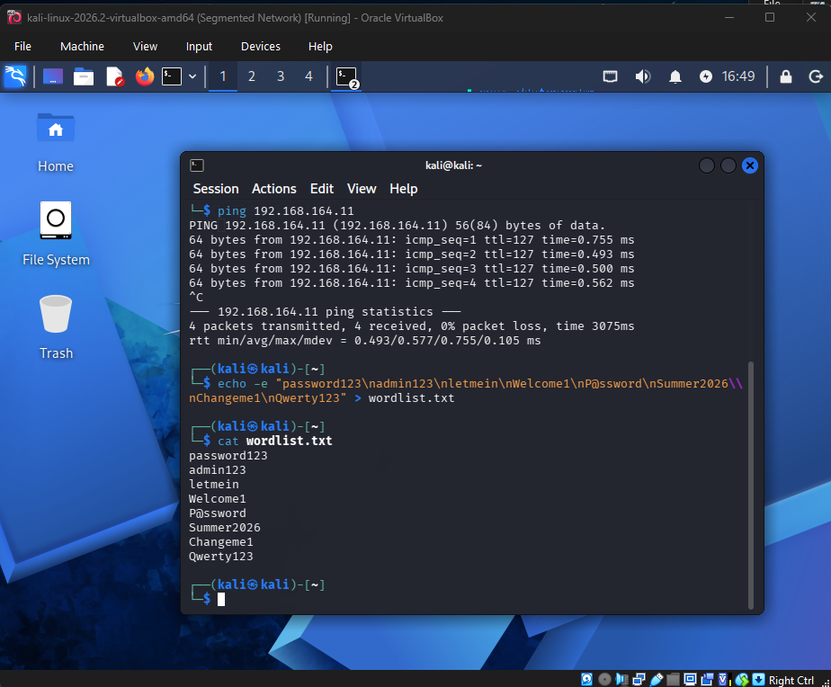
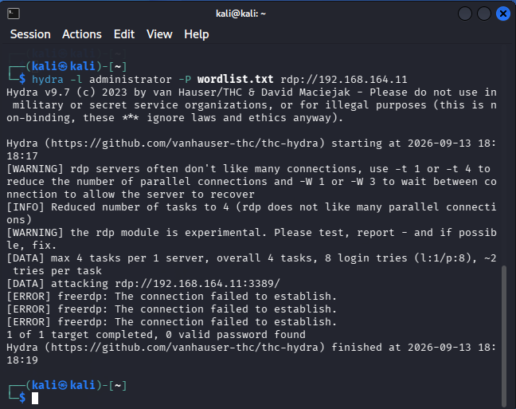
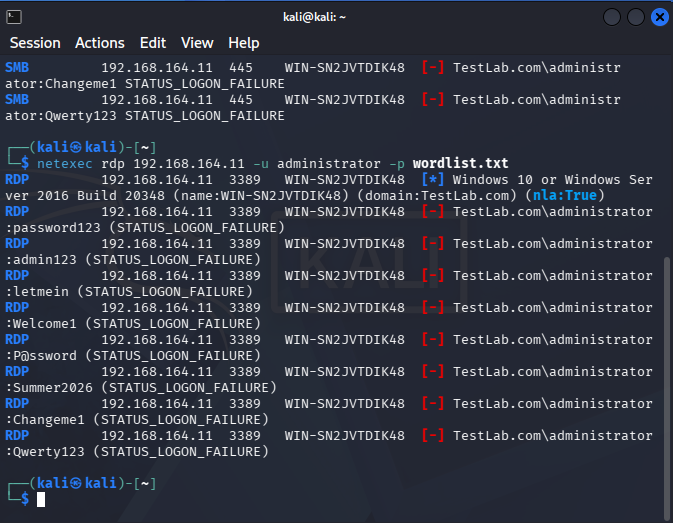
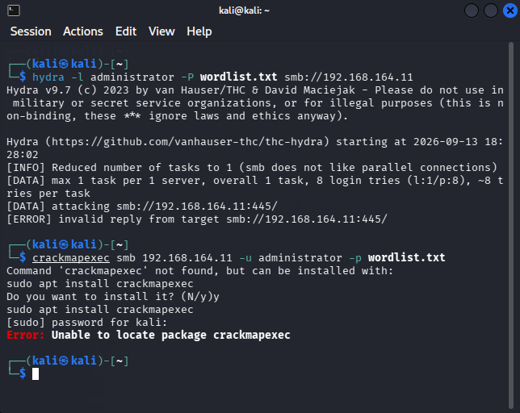
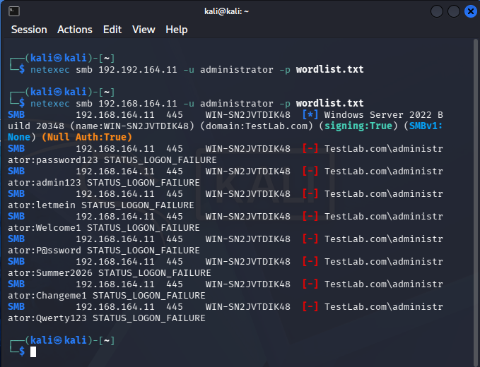
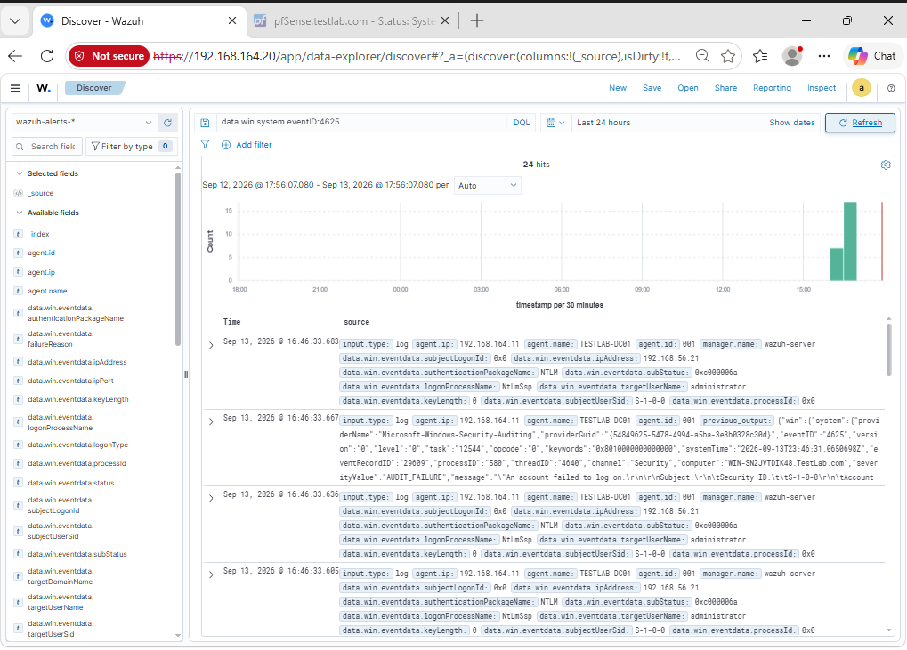
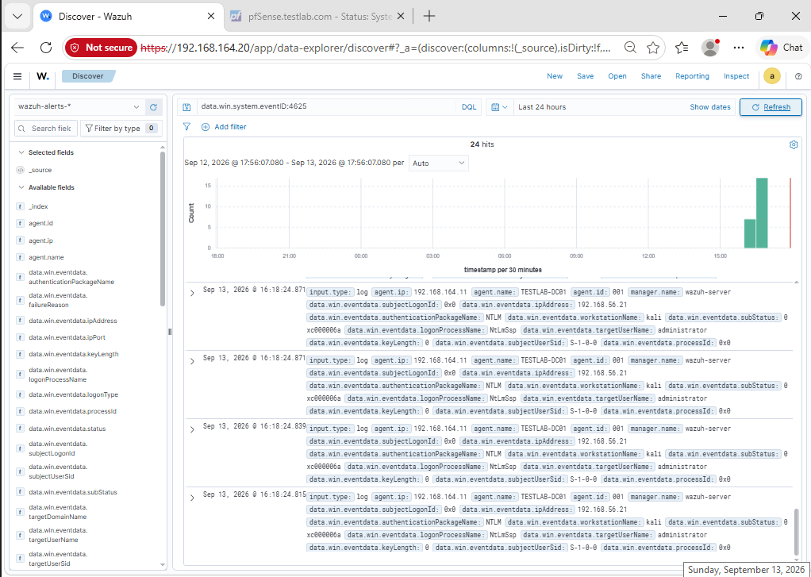
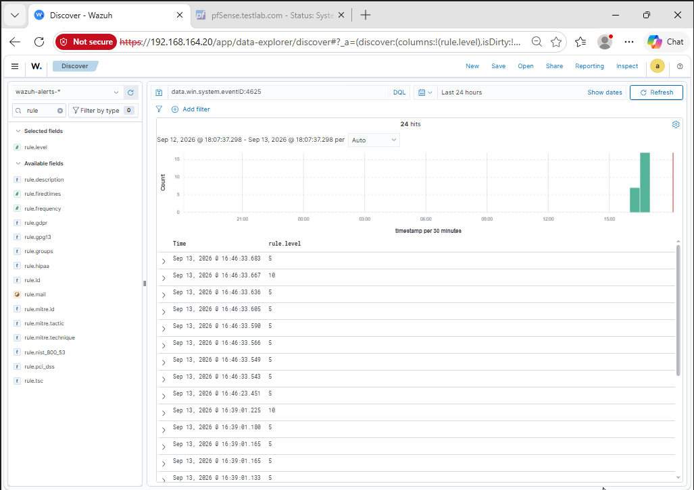
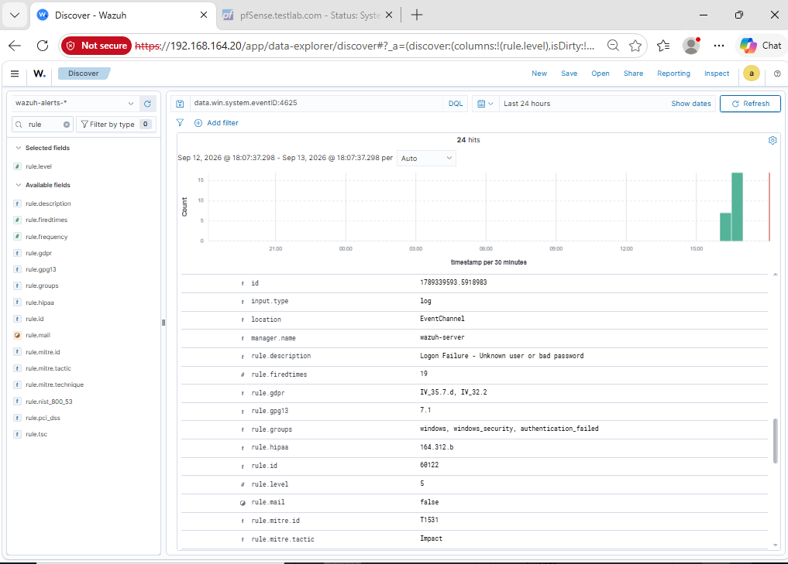

# Detection Exercise: Brute-Force Attack vs. Wazuh SIEM

**Author:** Hakeem Phillips
**Date:** 2026-09-13
**Tier:** 2 (Visibility / SIEM) — Part 6

## Objective

Prove that the SIEM (Security Information and Event Management) platform built earlier in Tier 2 doesn't just collect logs — it actually **detects** a real attack technique. A brute-force login attempt (systematically guessing passwords) is one of the most common attacks against exposed services like RDP (Remote Desktop Protocol) and SMB (Server Message Block, the Windows file-sharing protocol), which makes it a realistic first test: attack the Domain Controller (DC) from Kali over both protocols, then check whether Wazuh's default rules noticed.

## Step 1: Build a small wordlist and confirm connectivity

Rather than a massive real-world password list (which would take a long time and generate excessive noise), an 8-entry custom wordlist was created — enough to produce a clear "many failures, same account, short window" pattern without needing volume. A quick ping confirmed the attack path to the DC (`192.168.164.11`) was still open before starting.



## Step 2: RDP attack

### First attempt — Hydra (failed, and not obviously)

```
hydra -l administrator -P wordlist.txt rdp://192.168.164.11
```

This looked like a clean run at first glance — Hydra exited with `1 of 1 target completed, 0 valid password found` and no dramatic error. But the actual per-attempt output told a different story:

```
[ERROR] freerdp: The connection failed to establish.
[ERROR] freerdp: The connection failed to establish.
[ERROR] freerdp: The connection failed to establish.
```



**Root cause:** Hydra's RDP module never completed the connection handshake at all — no real login attempt ever reached the DC. This was later confirmed to be an NLA (Network Level Authentication) compatibility issue between Hydra's older FreeRDP-based module (which its own output flags as "experimental") and a modern Windows Server target that requires NLA by default.

**Lesson:** a tool's clean summary line is not proof it did what was intended. The one-line result looked like a completed, harmless test; the real per-line output showed it never actually tested anything.

### Second attempt — netexec (worked)

```
netexec rdp 192.168.164.11 -u administrator -p wordlist.txt
```

This one completed real authentication attempts, and its recon banner also fingerprinted the target before trying any credentials:

> `Windows 10 or Windows Server 2016 Build 20348 (name:WIN-SN2JVTDIK48) (domain:TestLab.com) (nla:True)`

Confirming `nla:True` — proof of exactly the requirement that broke Hydra's module — followed by 8 genuine `STATUS_LOGON_FAILURE` responses for `administrator`.



## Step 3: SMB attack

### First attempt — Hydra, then crackmapexec (both failed)

```
hydra -l administrator -P wordlist.txt smb://192.168.164.11
[ERROR] invalid reply from target smb://192.168.164.11:445/
```

Hydra's SMB module targets the legacy SMB1 protocol, which Windows Server 2022 disables by default — a secure default causing what looks like a tool failure, the same pattern encountered several times back in Tier 1 (RFC1918 blocking, WAN default-deny).

`crackmapexec` was tried as a fallback and failed to even install:

```
Error: Unable to locate package crackmapexec
```



### Second attempt — netexec (worked)

```
netexec smb 192.168.164.11 -u administrator -p wordlist.txt
```

Real authentication failures this time, plus a genuinely useful recon banner:

> `Windows Server 2022 Build 20348 (name:WIN-SN2JVTDIK48) (domain:TestLab.com) (signing:True) (SMBv1:None) (Null Auth:True)`

`signing:True` and `SMBv1:None` are both good hardening signs. **`Null Auth:True`** stood out as a real finding — the DC accepts anonymous/null SMB sessions, a legitimate gap flagged for remediation in Tier 3.



## Step 4: Checking Wazuh

### 4.1 — 4.2: Confirming the raw events arrived

Searching `data.win.system.eventID:4625` (Windows' standard "failed logon" event) returned **24 hits** over the prior 24 hours — matching the 8 SMB + 8 RDP attempts, with a couple of extra background entries. Source IP `192.168.56.21` (Kali) and workstation name `kali` confirmed these were genuinely the attack attempts, not unrelated noise.





### 4.3: The actual detection question — did Wazuh notice the *pattern*?

Individually logging failed logins is one thing; noticing that many of them happened in a burst is a different, more meaningful capability. Adding `rule.level` as a column across the same 24 hits showed the answer clearly: most events sat at **level 5**, but **two stood out at level 10**.



Expanding one of the level-5 baseline events revealed **rule 60122** — *"Logon Failure - Unknown user or bad password"* — fired once per individual failed login, mapped to MITRE ATT&CK **T1531 (Account Access Removal)**.



The level-10 entries told the real story: **rule 60204**, *"Multiple Windows Logon Failures,"* with `rule.frequency: 8` — matching the exact size of the wordlist — and correctly mapped to **T1110 (Brute Force)** under the **Credential Access** tactic (confirmed directly in the dashboard, not pictured separately here).

## Result

**Wazuh detected the brute-force attack out of the box, on both protocols, with no custom rule-writing required.** Two distinct layers of detection were confirmed:

1. **Individual event logging** (rule 60122) — every failed login is captured, though its MITRE mapping (T1531) is an inaccurate fit for a single failed logon.
2. **Pattern correlation** (rule 60204) — the SIEM recognized 8 failures in a short window as a distinct, higher-severity brute-force event, with *accurate* MITRE mapping (T1110, Credential Access).

That distinction — an individual event rule versus a correctly-classified correlation rule — is the actual payoff of building a SIEM instead of just reading raw logs by hand.

## Tools used

| Tool | Purpose | Outcome |
|---|---|---|
| Hydra v9.7 | RDP/SMB brute-force | Failed on both protocols (see root causes above) |
| crackmapexec | SMB brute-force (attempted fallback) | Failed to install |
| netexec | RDP + SMB brute-force | Succeeded on both, plus useful recon |
| Wazuh (Discover) | Detection validation | Confirmed both raw events and correlated alert |

## Next steps

- Remediate the **SMB Null Auth** finding in Tier 3 (AD hardening).
- Consider whether rule 60122's MITRE mapping is worth overriding with a custom rule in Tier 5, alongside the already-planned pfSense decoder work.
