# Cybersecurity Home Lab — Tier 3 Build Report

**Author:** Hakeem Phillips
**Date range:** 2026-09-14 through 2026-10-04
**Platform:** Oracle VirtualBox 7.2.6, hosted on Windows 11 Pro
**Status:** Tier 3 (Active Directory Hardening Baseline) complete

## 1. Objective

Move the domain from default configuration to deliberately configured. Tier 3 applies Group Policy for password and audit policy, organizes objects into Organizational Units (OUs), creates accounts with real privilege differences, closes an SMB null-session exposure found during Tier 2, and runs an authenticated vulnerability scan to establish a measured baseline and remediate at least one finding.

## 2. Starting State

- Single domain (`testlab.com`) on Windows Server 2022 Evaluation, with Windows 10 Client, Kali, pfSense, and the Wazuh SIEM from Tier 2.
- Default Active Directory configuration: everything in the built-in `Users` and `Computers` containers.
- No custom password or audit policy beyond Windows defaults.
- SMB allowed anonymous (null session) share enumeration, discovered during the Tier 2 brute-force exercise.

## 3. Build Summary

| Part | Work | Result |
|---|---|---|
| 1 | Null-session SMB hardening via Default Domain Controllers Policy | Anonymous share enumeration now returns `STATUS_ACCESS_DENIED` |
| 2 | `TestLab` OU with `Workstations`, `Users`, `Admins`, `Servers` sub-OUs | Client and user objects moved into place |
| 3 | Password policy on Default Domain Policy (length 12, complexity, 90-day max age, history 5) | Weak password change rejected by Active Directory |
| 4 | Audit policy GPO linked at domain root | Account, group, and logon events now logged and visible in Wazuh |
| 5 | Standard user (`Duncan Idaho`) and admin-tier account (`hp-admin`, Domain Admins) | Lifecycle events (4720, 4722, 4724, 4726, 4738, 4728) confirmed in Wazuh |
| 6 | Nessus Essentials authenticated vulnerability scan; remediation of the DC | Critical findings cleared on the DC; SWEET32 cipher finding remediated |

## 4. Troubleshooting Log

### 4.1 Netexec banner still reported `Null Auth: True` after the GPO fix
- **Observation:** The recon banner still showed `Null Auth:True` after both anonymous-enumeration settings were enabled and applied.
- **Root cause:** The banner measures whether an anonymous *session* can be established. These policy settings restrict what an anonymous session can *do*, not whether it can connect.
- **Verification:** `netexec smb 192.168.164.11 -u '' -p '' --shares` returned `[+]` (session established) followed by `Error enumerating shares: STATUS_ACCESS_DENIED`. Before the fix, the same command returned the share list.
- **Lesson:** Verify the actual impact (what the attacker can do), not just a summary flag.

### 4.2 Audit policy: GPO applied, but Security Group Management events missing
- **Issue:** Account creation and deletion events (4720, 4726) appeared in Wazuh, but adding a user to Domain Admins (4728) never did.
- **Root cause:** Group membership changes belong to a separate audit subcategory, **Security Group Management**, which the Part 4 setup had not enabled. `auditpol /get /category:"Account Management"` showed it as `No Auditing`.
- **Fix:** Enabled Success and Failure for Security Group Management, ran `gpupdate /force`, and rebooted the DC. The 4728 event then appeared in Wazuh.
- **Lesson:** `gpresult` confirms a GPO is applied, not that each audit subcategory is enforced. Confirm with `auditpol`, then test the real event.

### 4.3 Wazuh time-range quick filter hid recent events
- **Issue:** Account lifecycle events did not appear with "Last 24 hours" but appeared with "This week."
- **Root cause:** Wazuh's quick-range boundaries don't always align with when events were recorded, a recurring issue on this isolated lab network.
- **Fix:** Widen the time range before concluding an event wasn't logged.

### 4.4 Nessus plugin compilation and an unreachable web UI
- **Issue:** After activation, Nessus reported "Plugins are compiling," and later `localhost:8834` became unreachable after a VM restart.
- **Root cause:** Plugin compilation runs locally after the feed download. The web service was not running after the restart.
- **Fix:** Waited for compilation to finish, then used `systemctl status nessusd` and `systemctl restart nessusd` to bring the service back.

### 4.5 Kali could not reach the Nessus download or the internal network
- **Issue:** Kali could reach its NAT connection for internet access, but traffic to the internal lab stopped working once the NAT adapter was involved.
- **Root cause:** Kali had two default routes. The static route through pfSense (metric 100) was preferred over the NAT route (metric 101). Traffic to the internet was sent to pfSense, which has no internet uplink.
- **Fix:** Removed the default route during the internet-dependent setup. Once finished, restored a route scoped only to the lab subnet: `ip route add 192.168.164.0/24 via 192.168.56.10 dev eth0`. Internet traffic continues via NAT and lab traffic goes through pfSense.
- **Lesson:** Route metrics decide which path wins. Manually added routes do not survive a reboot.

### 4.6 Nessus found only the DC, not the Client
- **Issue:** Scans listed only `192.168.164.11` even though both hosts were targeted.
- **Root cause (not the first guess):** The first assumption was that the Client's Windows Firewall was blocking ICMP discovery. The pfSense WAN rule was the actual blocker: the Tier 1 WAN rule was scoped only to the DC. Kali had no rule allowing traffic to the Client.
- **Fix:** Added a WAN rule for Kali (`192.168.56.21/32`) to the Client (`192.168.164.12/32`), protocol Any, logged, with the description "Allow Kali vulnerability scan access to Client (Nessus)." The pfSense log confirmed matched traffic.
- **Lesson:** Firewall rules written for one scenario don't automatically cover new ones. Scope creep in rule sets is common and worth documenting.

### 4.7 Client authenticated scan failed: Remote Registry disabled
- **Issue:** The Client showed `Auth: Fail` even with valid credentials. The "Target Credential Status" plugin confirmed SMB login succeeded.
- **Root cause:** The "OS Security Patch Assessment Failed" plugin reported `Could not connect to \winreg`. The Remote Registry service is disabled by default on Windows 10 workstations, which is a deliberate hardening default.
- **Fix:** Started the Remote Registry service for the scan. In a hardened environment, this would be a temporary exception, with patch status checked through endpoint management tooling instead.

### 4.8 Client SMB blocked by Windows Firewall after the pfSense rule was added
- **Issue:** Even with the pfSense rule passing traffic, the Client didn't respond to SMB (port 445) from Kali.
- **Root cause (two parts):**
  1. The **Private** profile rule for "File and Printer Sharing (SMB-In)" was disabled. The Domain and Public rules were enabled.
  2. The enabled rule's remote address scope was `LocalSubnet` (`192.168.164.0/24`), which excludes Kali (`192.168.56.21`).
- **Fix:** Enabled the Private rule and changed its remote address scope to `192.168.56.21` only, keeping the exception as narrow as possible.

### 4.9 DC SWEET32 finding (3DES cipher enabled)
- **Issue:** A High-severity finding (CVSS 7.5, CVE-2016-2183) flagged DES-CBC3-SHA (3DES) as enabled.
- **Root cause:** A configuration setting in Schannel. Windows Updates do not disable weak ciphers.
- **Fix:** Set `Enabled = 0` under `HKLM:\SYSTEM\CurrentControlSet\Control\SecurityProviders\SCHANNEL\Ciphers\Triple DES 168`, rebooted the DC, and confirmed the finding cleared on rescan. A snapshot was taken before the change.
- **Lesson:** A typo in the registry path silently created a stray key, which I removed. Reading back the value after each change caught it.

## 5. Part 6 Vulnerability Findings

### 5.1 Baseline and results

| Severity | DC baseline | DC after Windows Update | DC after 3DES disable | Client (unpatched) |
|---|---|---|---|---|
| Critical | 23 | 0 | 0 | 7 |
| High | 47 | 2 | 1 | 28 |
| Medium | 8 | 4 | 4 | — |
| Info | 107 | 106 | ~106 | — |

The Client was intentionally left unpatched as a comparison point.

### 5.2 Remediation status

| Finding | Host | Severity | CVSS | Status |
|---|---|---|---|---|
| Missing Microsoft cumulative updates (bulk Critical and High) | DC | Critical / High | Various | Remediated (Windows Update, September 2026 set) |
| SWEET32: SSL Medium Strength Cipher Suites (3DES) | DC | High | 7.5 (CVE-2016-2183) | Remediated (Schannel 3DES disabled) |
| SMB anonymous enumeration (null session) | DC | Found in Tier 2 | — | Remediated (Default Domain Controllers Policy) |
| Missing Microsoft Bulletin update | DC | High | 8.8 | Open |
| SSL/TLS configuration findings | DC | Medium | 6.5 (×4) | Open |
| Missing updates and configuration findings | Client | Critical / High | Various | Open (not patched by design) |

Open items are deliberate for now and will be addressed in a future pass.

## 6. Evidence

### Part 1: SMB null-session hardening
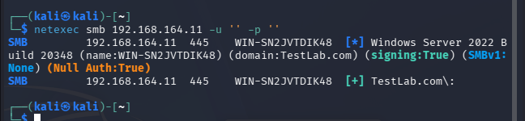

### Part 2: OU structure
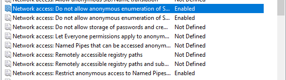
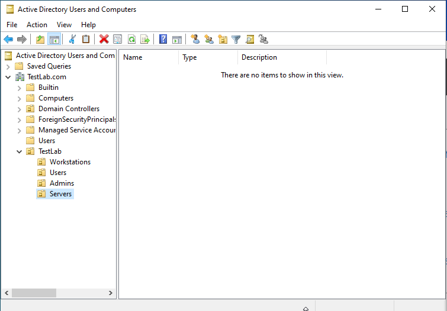
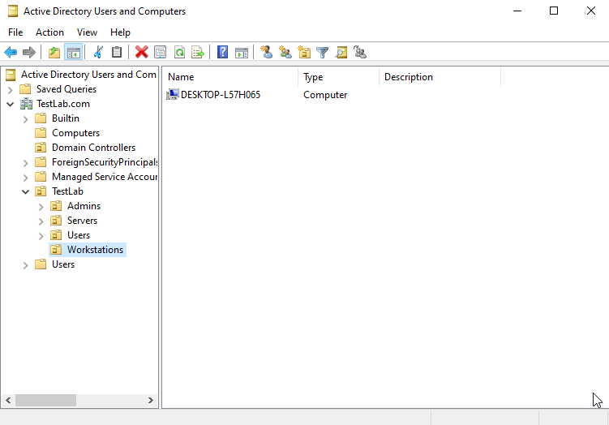

### Part 3: Password policy
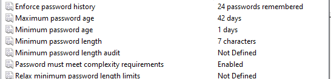
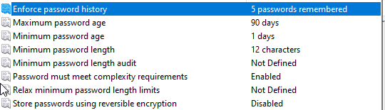
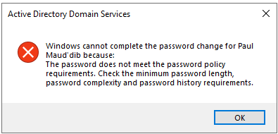

### Part 4: Audit policy
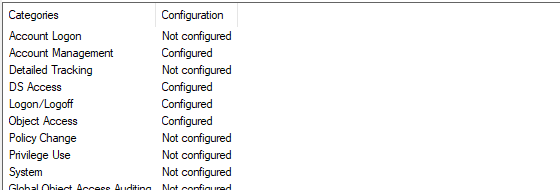
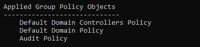
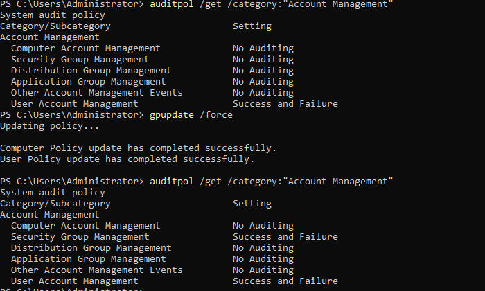

### Part 5: Accounts and Wazuh validation
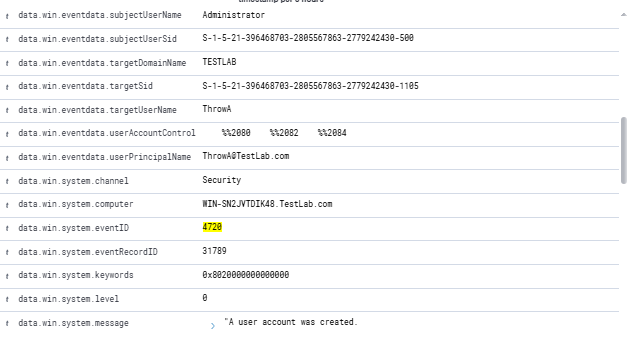
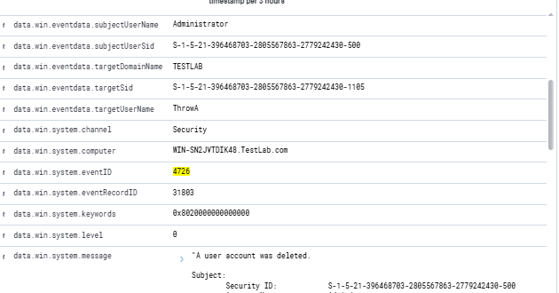
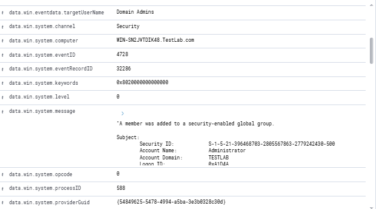

### Part 6: Vulnerability scan and remediation
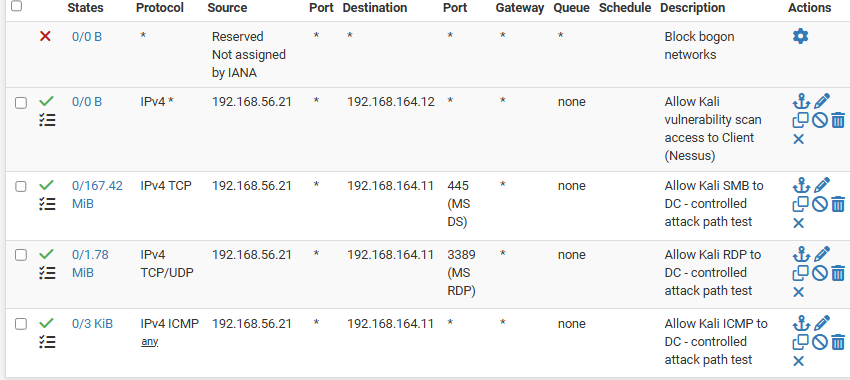
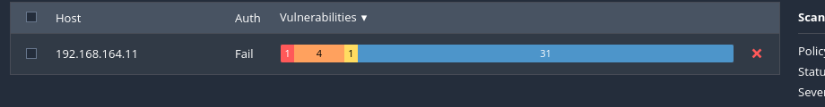
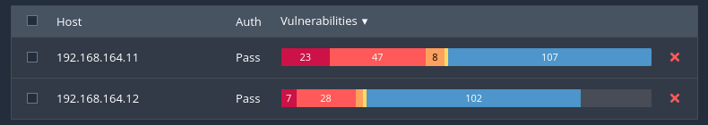
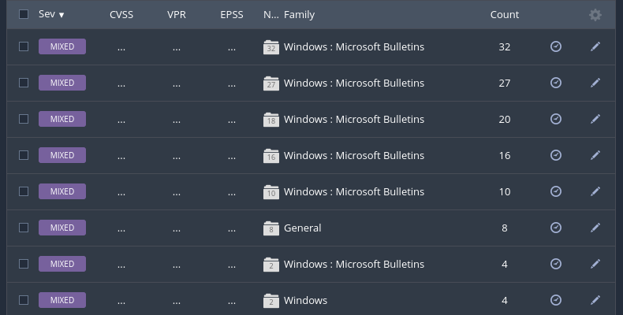
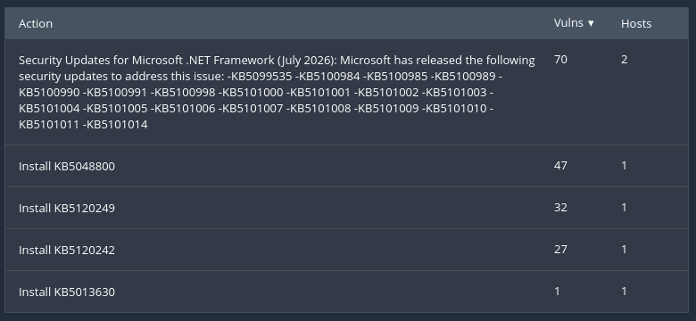
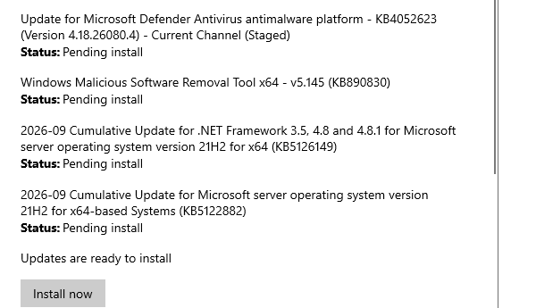
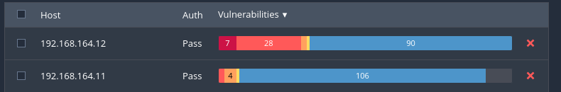
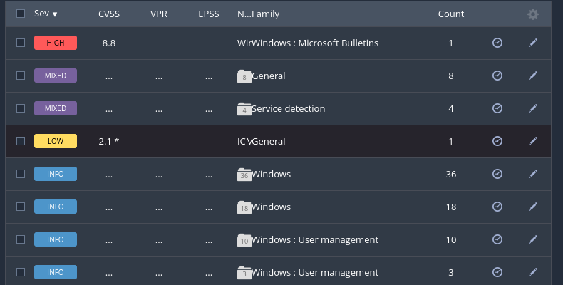
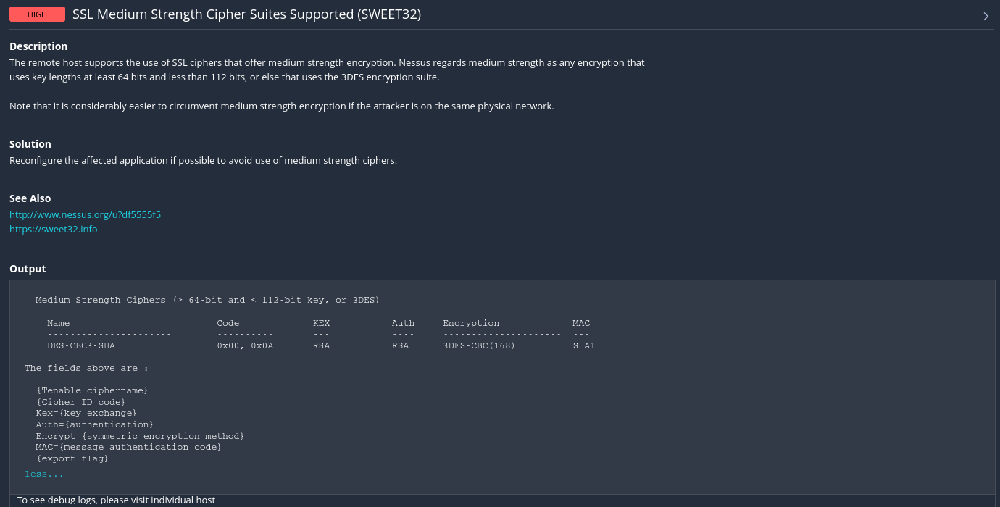
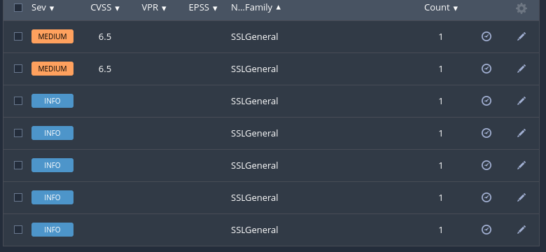

## 7. Key Lessons Learned

- **A GPO being applied is not the same as its effect being enforced.** Confirm with the effective-state tool (`auditpol`, `netexec` results) and test the real behavior. Several settings needed a reboot or service restart.
- **Scanner summary flags measure different things than impact.** The "Null Auth" banner remained true while anonymous enumeration was actually blocked.
- **Firewall scope is a living document.** The Tier 1 WAN rules covered one attack path. A vulnerability scanner needed a different one.
- **Authenticated scans see far more than unauthenticated ones.** The first unauthenticated scan returned mostly informational findings. Credentialed scanning surfaced the real critical and high issues.
- **Windows Update and configuration hardening solve different problems.** Patching cleared most of the Critical and High findings, but a weak cipher setting needed its own change.
- **Verify every change by reading it back.** A registry path typo created a stray key that would have been easy to miss.

## 8. Next Steps

- Address the open items: the 8.8 Microsoft Bulletins update and the SSL/TLS Medium findings.
- Decide whether to patch the Client to compare results.
- Tier 4: attack simulation against the hardened domain, using the privilege differences and audit policy built in this tier.
