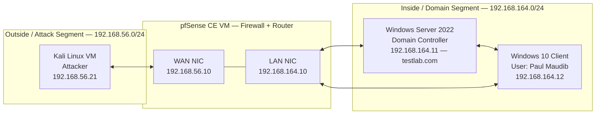

# Segmented Cybersecurity Home Lab

I built this after finishing my CompTIA Security+ cert because I wanted a real place to break things and fix them instead of just reading about it. It's a small virtualized network with a Windows domain sitting behind a pfSense firewall, plus a Kali box on its own segment for attacking it. Basically a mini corporate network I get to be both system admin and attacker on.

Full write-up of everything that went wrong (a lot did) and how I fixed it: [`2026-08-23_tier1-build-report.md`](./2026-08-23_tier1-build-report.md)
Network diagram + IP addressing: [`2026-08-06_homelab-network-diagram.md`](./2026-08-06_homelab-network-diagram.md)
The checklist I followed while building it: [`2026-08-06_tier1-network-foundations-checklist.md`](./2026-08-06_tier1-network-foundations-checklist.md)

---

## Architecture

Two separate host-only networks in VirtualBox, only connected through pfSense. Neither one touches the internet, and there's no direct path between Kali and the domain that doesn't go through the firewall.

## What I actually practiced here

- **Segmenting a network** — started with everything flat on one virtual switch, ended with attacker and domain fully separated and only reachable through a firewall.
- **Writing firewall rules that don't suck** — scoped to specific IPs and ports instead of "allow everything," and figuring out *why* some rules I wrote never actually did anything (see below, that one bugged me for a while).
- **Active Directory basics** — stood up a DC, DNS, users, the whole thing.
- **Actually troubleshooting instead of guessing** — testing one hop at a time (client → gateway → firewall → target) instead of randomly changing settings until something works.
- **Defense-in-depth, for real this time** — watched a packet get allowed by the firewall and still get dropped by Windows Firewall on the other end. Good reminder that one layer of security isn't security.
- **Reading logs properly** — including realizing "no logs" doesn't always mean "nothing's happening," sometimes it just means logging isn't turned on (learned that one the hard way).

## Tools

| Component | Tool |
|---|---|
| Hypervisor | Oracle VirtualBox 7.2.6 |
| Firewall / Router | pfSense CE |
| Domain Controller | Windows Server 2022 + Active Directory |
| Client | Windows 10 |
| Attacker box | Kali Linux 2026 |

## Some of the stuff that went wrong (my favorite part honestly)

Full details in the [build report](./2026-08-23_tier1-build-report.md), but here's the highlight reel:

- **pfSense flat out wouldn't boot** — `CPU doesn't support long mode`. Turns out I had the VM set to a 32-bit OS type, which hides 64-bit CPU features even though my actual CPU supports them fine. Rookie mistake, quick fix once I found it.
- **Almost blocked myself out of my own attack lab.** pfSense blocks private IP ranges on WAN by default, which makes sense for a real firewall facing the actual internet — except my "WAN" is also a private IP range, since it's all virtual. Left unchecked, that setting would've silently eaten every single packet Kali sent, and I'd have had no idea why.
- **Wrote three firewall rules that never fired.** Client-to-DC rules for DNS/Kerberos/LDAP, all correctly written, zero hits in the logs no matter what I tried. Took a bit to realize the problem wasn't the rules at all — the client and DC are on the same subnet, so their traffic never actually routes through the firewall in the first place. Kind of a fun "wait, that's not how I thought this worked" moment.
- **Chased a connectivity bug through like four different layers** before Kali could finally ping the DC — missing gateway, then a stale network interface on pfSense from earlier troubleshooting, then confusion over the firewall correctly refusing to ping itself (that one's on purpose, not a bug). Systematically ruling things out one hop at a time is what actually got me through it instead of just changing random settings.
- **Firewall passed my ping, DC still ignored it.** Classic — Windows Firewall was blocking ICMP locally even though pfSense let it through fine. Nice hands-on reminder that network-level and host-level firewalls are two separate things.

## Firewall Rules

**LAN — Client → Domain Controller** (AD logon ports, written for practice — doesn't actually get exercised for the reason above):

| Protocol | Port | Purpose |
|---|---|---|
| TCP/UDP | 53 | DNS |
| TCP/UDP | 88 | Kerberos |
| TCP/UDP | 389 | LDAP |

**WAN — Kali → Domain Controller** (this is the one that's actually live and logging):

| Protocol | Port | Purpose |
|---|---|---|
| ICMP | — | Ping / connectivity test |
| TCP/UDP | 3389 | RDP |
| TCP | 445 | SMB |

Everything else on WAN is blocked by default — no rule, no traffic.

## What's next

- **Tier 2:** Get a SIEM (or a lightweight sensor at least) on the domain side, since the firewall literally cannot see traffic that stays within the same subnet.
- **Tier 3:** Actually harden the domain a bit — Group Policy, audit policy, a real vuln scan.
- **Tier 4:** Start attacking through the SMB/RDP path I opened up and see what the SIEM does (or doesn't) catch.

## What's in this repo

| File | What it is |
|---|---|
| `README.md` | You're reading it |
| `2026-08-23_tier1-build-report.md` | The full story — every issue, root cause, and fix |
| `2026-08-06_homelab-network-diagram.md` | Diagrams + final IP addressing |
| `2026-08-06_tier1-network-foundations-checklist.md` | The checklist I actually followed while building this |
