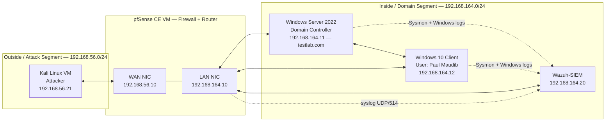
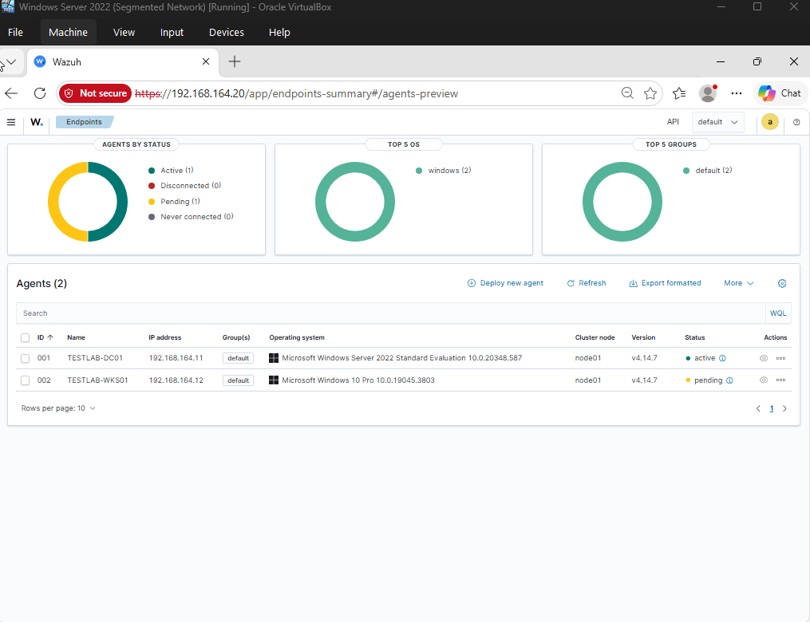

# Cybersecurity Virtual Lab Build

I built this after finishing my CompTIA Security+ cert because I wanted a real place to break things and fix them instead of just reading about it. It's a small virtualized network with a Windows domain sitting behind a pfSense firewall, a Kali box on its own segment for attacking it, and a Wazuh SIEM watching everything. Basically a mini corporate network I get to be sysadmin, attacker, and defender on, all at once.

I'm building this in tiers, each one on top of the last. Jump to whichever one you want:

- [Tier 1: Network Foundations](#tier-1-network-foundations)
- [Tier 2: Visibility (SIEM)](#tier-2-visibility-siem)
- [Tools](#tools)
- [What's Next](#whats-next)
- [Repo Contents](#repo-contents)

Network diagram + full as-built IP addressing: [`2026-08-06_homelab-network-diagram.md`](./2026-08-06_homelab-network-diagram.md)

---

## Architecture

Two separate host-only networks in VirtualBox, only connected through pfSense. Neither one touches the internet, and there's no direct path between Kali and the domain that doesn't go through the firewall. The SIEM sits on the domain segment, picking up what the firewall structurally can't see.

---

## Tier 1: Network Foundations

Took a flat network (everything on one virtual switch) and put a real firewall boundary in the middle of it, with logged, least-privilege rules instead of "allow everything."

**Full write-up:** [`2026-08-23_tier1-build-report.md`](./2026-08-23_tier1-build-report.md)

### What I actually practiced

- **Segmenting a network** — started with everything flat on one virtual switch, ended with attacker and domain fully separated and only reachable through a firewall.
- **Writing firewall rules** — scoped to specific IPs and ports instead of "allow everything," and figuring out *why* some rules I wrote never actually did anything (see below, that one bugged me for a while).
- **Active Directory basics** — stood up a DC, DNS, users, the whole thing.
- **Actually troubleshooting instead of guessing** — testing one hop at a time (client → gateway → firewall → target) instead of randomly changing settings until something works.
- **Defense-in-depth, for real this time** — watched a packet get allowed by the firewall and still get dropped by Windows Firewall on the other end. Good reminder that one layer of security isn't security.
- **Reading logs properly** — including realizing "no logs" doesn't always mean "nothing's happening," sometimes it just means logging isn't turned on (learned that one the hard way).

### Some of the stuff that went wrong

- **pfSense flat out wouldn't boot** — `CPU doesn't support long mode`. Turns out I had the VM set to a 32-bit OS type, which hides 64-bit CPU features even though my actual CPU supports them fine. Rookie mistake, quick fix once I found it.
- **Wrote three firewall rules that never fired.** Client-to-DC rules for DNS/Kerberos/LDAP, all correctly written, zero hits in the logs no matter what I tried. Took a bit to realize the problem wasn't the rules at all. The client and DC are on the same subnet, so their traffic never actually routes through the firewall in the first place. Kind of a fun "wait, that's not how I thought this worked" moment.
- **Chased a connectivity bug through like four different layers** before Kali could finally ping the DC. A missing gateway, then a stale network interface on pfSense from earlier troubleshooting, then confusion over the firewall correctly refusing to ping itself (that one's on purpose, not a bug). Systematically ruling things out one step at a time is what actually got me through it instead of just changing random settings.
- **Firewall passed my ping, DC still ignored it.** The Windows Firewall was blocking ICMP locally even though pfSense let it through fine. Nice hands-on reminder that network-level and host-level firewalls are two separate things.

### Firewall Rules

**LAN — Client → Domain Controller** (AD logon ports, written just for practice):

| Protocol | Port | Purpose |
|---|---|---|
| TCP/UDP | 53 | DNS |
| TCP/UDP | 88 | Kerberos |
| TCP/UDP | 389 | LDAP |

**WAN — Kali → Domain Controller** (this is the one that's actually live and logging):

| Protocol | Port | Purpose |
|---|---|---|
| ICMP | — | Ping / connectivity test |
| TCP/UDP | 3389 | RDP |
| TCP | 445 | SMB |

Everything else on WAN is blocked by default. NO RULE, NO TRAFFIC.

---

## Tier 2: Visibility (SIEM)

Tier 1 taught me something annoying: pfSense can only see traffic that actually crosses between my two segments. Anything happening between the Client and DC on the same subnet? Completely invisible to the firewall, no matter how good my rules were. So Tier 2 was about fixing that — added a SIEM (Security Information and Event Management — basically a system that pulls logs from everything into one place you can actually search) called Wazuh, put agents on the DC and Client, layered Sysmon on top for way better process-level detail, and got pfSense forwarding its firewall logs in too.

Then I actually attacked my own DC from Kali to see if any of it worked. It did.

**Full write-up:** [`2026-09-13_tier2-build-report.md`](./2026-09-13_tier2-build-report.md)
**The attack + detection exercise, step by step with screenshots:** [`2026-09-14_tier2-visibility-exercise-report.md`](./2026-09-14_tier2-visibility-exercise-report.md)

### What I actually practiced

- **Standing up a SIEM from scratch** — deploying Wazuh, figuring out its actual OS (turns out it's Amazon Linux, not Ubuntu like I assumed — cost me a bit of time before I checked instead of guessing), and getting it talking to everything else on the domain segment.
- **Endpoint visibility with Sysmon** — default Windows logging is pretty thin. Sysmon gets you real process trees, command lines, network connections. Night and day difference once it's running.
- **Reading a tool's output critically, not just its summary line.** Hydra told me an RDP brute-force attempt "completed" with 0 valid passwords found — sounds like a clean negative result. It wasn't. Buried in the actual output, every single connection attempt had failed to even establish. The tool never tested anything real. Good reminder to actually read what a tool did, not just its exit message.
- **Attacking my own domain controller on purpose** — brute-forced RDP and SMB against the DC with a small wordlist, just to see if my new detection stack would notice.
- **Understanding the difference between "logged" and "detected."** Wazuh logged every single failed login individually (fine, but not that impressive on its own). The part that actually mattered: it *also* noticed the pattern — 8 failures, same account, short window — and fired a separate, correctly-classified "possible brute force" alert on top of the individual logs. That's the actual point of a SIEM instead of just reading raw logs by hand.

### Some more stuff that went wrong

- **Wrong OS, wrong instructions.** Spent a while trying to configure Wazuh's networking like it was Ubuntu before checking `/etc/os-release` and finding out it's Amazon Linux. Different network config system entirely. Lesson: check first, don't assume.
- **pfSense's clock silently went stale — again.** Same root issue as Tier 1 (no internet = no time sync), except this time it quietly broke my ability to find pfSense's logs in Wazuh's search results for way longer than it should have, since "last 24 hours" doesn't find anything if the machine sending the logs thinks it's a different day.
- **Hydra lied to me, kind of.** Covered above, but worth repeating: "0 valid passwords found, target completed" looked like a real test. It wasn't one. The SMB side failed for a more expected reason — Hydra's SMB module only speaks the old, insecure SMB1 protocol, which Windows Server 2022 disables by default. A secure default breaking my attack tool, not a bug.
- **Found a real security gap by accident.** While brute-forcing SMB, the recon output from my substitute tool (`netexec`) flagged that the DC accepts anonymous/null SMB sessions. Wasn't looking for that, but it's a legitimate hardening item now queued up for Tier 3.

### Known limitation

pfSense's raw syslog reaches Wazuh fine (confirmed at the packet level), but it doesn't show up as a proper Wazuh alert — there's no built-in decoder for pfSense's log format. Deliberately deferred to Tier 5 instead of forced through tonight: writing that decoder is a real exercise on its own.

---

## Tools

| Component | Tool |
|---|---|
| Hypervisor | Oracle VirtualBox 7.2.6 |
| Firewall / Router | pfSense CE |
| Domain Controller | Windows Server 2022 + Active Directory |
| Client | Windows 10 |
| Attacker box | Kali Linux 2026 |
| SIEM | Wazuh (Amazon Linux 2023) |
| Endpoint telemetry | Sysmon |
| Brute-force testing | netexec (Hydra didn't hold up against modern Windows defaults — see Tier 2 write-up) |

---

## What's Next

- **Tier 3:** AD hardening baseline — Group Policy, audit policy, and fixing that SMB null-session gap I found by accident.
- **Tier 4:** Real attack simulation through the SMB/RDP path I already opened up, now that I know the SIEM actually catches things.
- **Tier 5:** Write a custom Wazuh decoder so pfSense's own logs show up as real alerts instead of just raw data.

---

## Repo Contents

| File | What it is |
|---|---|
| `README.md` | You're reading it |
| `2026-08-06_homelab-network-diagram.md` | Network diagrams + as-built IP addressing, all tiers |
| `2026-08-23_tier1-build-report.md` | Full Tier 1 build narrative and troubleshooting log |
| `2026-09-13_tier2-build-report.md` | Full Tier 2 build narrative and troubleshooting log |
| `2026-09-14_tier2-visibility-exercise-report.md` | The brute-force attack + detection exercise, in detail |
| `screenshots/tier2/` | Screenshots from the Tier 2 build |
| `screenshots/tier2-exercise/` | Screenshots from the detection exercise |
